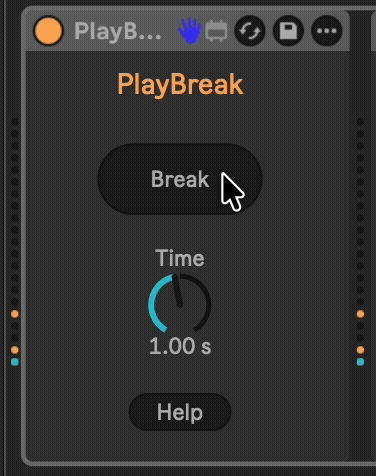

# PlayBreak

Provides a button, when pressed pauses MIDI output for a configurable time and immediately sends an All Notes Off (CC 123) message and a Sustain Off message (64 0). Once the timer expires, then MIDI communication is resumed.

## Installation

[Download the newest release](https://github.com/zsteinkamp/m4l-PlayBreak/releases) or clone this repository, and drag the `PlayBreak.amxd` device into a track in Ableton Live.

## Changelog

- 2026-04-28 [v1](https://github.com/zsteinkamp/m4l-PlayBreak/releases/download/v1/PlayBreak.amxd) - Initial Release.

## Usage

* Add this device to a MIDI track.
* Use the `Time` dial to control the duration that MIDI events will be discarded.
* Press or automate the `Break` button to take a break.

## TODO

- ...
